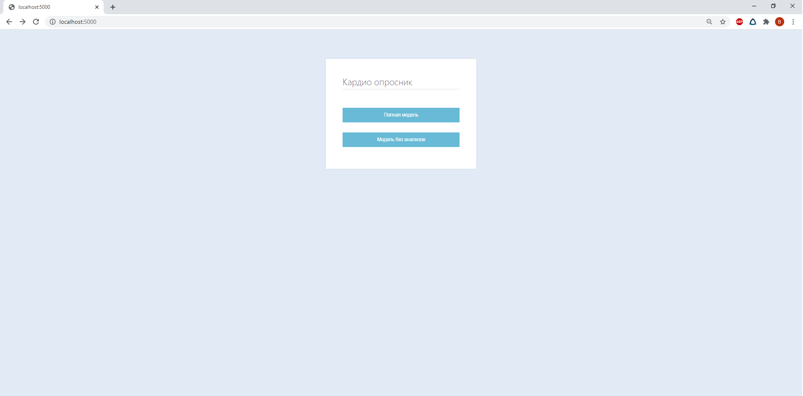
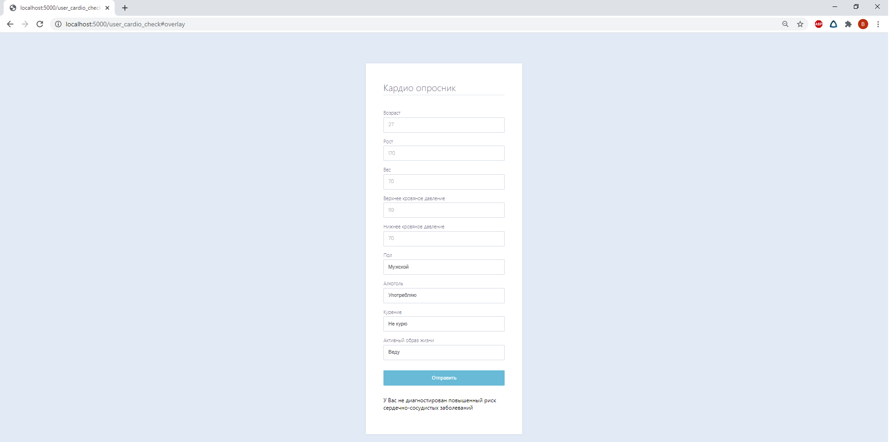

## Общее описание решения

Проект является цифровым решением в рамках конкурса World AI&DATA Challenge, соответствующим задаче ["Сервис по выявлению факта развития сердечно-сосудистых заболеваний (далее - ССЗ) (инфаркт, инсульт) на основании оценки сердечно-сосудистого риска."](https://git.asi.ru/tasks/world-ai-and-data-challenge/service-for-detecting-the-development-of-cardiovascular-diseases)

Из всех рекомендованных датасетов по данной тематике мы выбрали наиболее подходящий по совокупности параметров. Мы провели подробную аналитику данного датасета. Проведя сравнительный анализ различных моделей машинного обучения, мы подобрали наиболее подходящую по совокупности различных метрик качества. 

Для интеграции модели мы создали удобный api сервер. Кроме того, мы реализовали сайт для демонстрации решения. Для кроссплатформенности наши решения были обернуты в Docker

## Общее описание логики работы решения

С аналитической частью решения по фильтрации данных и настройке модели можно ознакомиться в [файле](analytics/analytics.ipynb)

В самом же решении используются уже отфильтрованные данные на предобученной модели.

При желании можно заново отфильтровать данные, установив необходимые Python библиотеки

      # Заново подготовить данные
      cd production
      python model_creation/preprocess.py

или снова обучить модели, предварительно задав параметры в [файле](production/settings/params.json)

      # Переобучить модель
      cd production
      python model_creation/train.py
      python model_creation/train.py --model_type=main

Для наилучшей модели мы подобрали наиболее оптимальные параметры путем перебора по сетке и подобрали для неё наилучший порог отсева по соотношению точности и полноты. Также сделана вторая модель без учетов анализа крови.
В качестве модели классификации мы используем градиентный бустинг LGBMClassifier

Модель обернута в сайт с API, написанный на flask

Для использования решение нужно запустить сервер, затем перейти на сайт или пользоваться API

## Требования к окружению для запуска продукта
Кроссплатформенное решение из коробки(Docker): Linux, Windows, macOS

Или при помощи Python 3.7.5

## Сценарий сборки и запуска проекта
Запуск сервера

Через [Docker](https://docs.docker.com/get-docker/):

      docker build -t heart .
      docker run -p 5000:5000 heart

или через Python:

      pip install -r requirements.txt
      cd production
      python web_app/run.py

Затем перейдите по ссылке http://localhost:5000/ 

## Примеры использования
Пример использования и описание API представлено в [файле](production/tests/api_request.py), его можно протестировав следующим образом:

      cd production
      python tests/api_request.py

После запуска сервера перейдите по ссылке http://localhost:5000/ 

Перед Вами будет выбор модели:

Выберите полную модель, если у Вас есть данные по глюкозе и по холестерину, она на несколько процентов точнее. Или же выберите "Модель без анализов". Она на несколько процентов менее точная, но зато большинство людей дома могут померить необходимые параметры.

Далее заполните опросник и получите результат

## Используемые наборы данных

Данные взяты из открытого [источника](https://www.kaggle.com/sulianova/cardiovascular-disease-dataset) и приложены к проекту в [сыром](production/dataset/cardio_train.csv) и [отфильтрованном](production/dataset/clean_cardio_train.csv) виде

Столбцы обработанного датасета:

1. Возраст, age, в годах
2. Рост, height, в сантиметрах
3. Пол, gender, 1 - женский, 0 - мужской
4. Верхнее давление, ap_hi, в мм рт. ст.
5. Нижнее давление, ap_lo, в мм рт. ст.
6. Уровень холестерина в крови, cholesterol, 1 - нормальный, 2 - повышенный, 3 - сильно повышенный
7. Уровень глюкозы в крови, gluc, 1 - нормальный, 2 - повышенный, 3- сильно повышенный
8. Курение, smoke, 1 - курит, 0 - не курит
9. Алкоголь, alco, 1 - употребляет, 0 - не употребляет
10. Физическая активность, active, 1 - занимается, 0 - не занимается
11. ИМТ(индекс массы тела), bmi, кг/м^2
12. Пульсовое давление, diff, кг/м^2
13. Наличие сердечно-сосудистых заболеваний, cardio, 1 - есть, 0 - нету

## General Solution Description

This project is a digital solution within the World AI&DATA Challenge, corresponding to the task ["Service for detecting the development of cardiovascular diseases"](https://git.asi.ru/tasks/world-ai-and-data-challenge/service-for-detecting-the-development-of-cardiovascular-diseases).

Of all the recommended datasets on this topic, we have chosen the most appropriate one for the set of parameters. We conducted detailed analysis of this dataset. After comparative analysis of different models of machine learning, we selected the most appropriate set of different quality metrics. 
 

We have created a convenient api server for model integration .In addition, we implemented a website to demonstrate the solution. Our solutions were wrapped in Docker for cross-platformity. 

## Solution's logics general description

The analytical part of the solution for data filtering and model tuning can be found in [file](analytics/analytics.ipynb).

The solution uses already filtered data on a pretrained model.

If desired, you can re-filter data by installing the necessary Python libraries

      # re-filter data
      cd production
      python model_creation/preprocess.py

or retrain the models by setting the parameters in the [file](production/settings/params.json).

      # retrain model
      cd production
      python model_creation/train.py
      python model_creation/train.py --model_type=main

For the best model, we selected the most optimal parameters by iterating through the grid and selected the best threshold for it in terms of precision and recall. We also made a second model without taking into account the blood test.

We use the LGBMClassifier gradient boosting as a classification model.

The model is wrapped in a website with an API written in flask.

To use the solution, you need to start the server, then go to the site or use the API

## Execution environmental requirements and setup
Docker or Python 3.7.5

## Compilation and launch scenario
Server start

[Docker](https://docs.docker.com/get-docker/):

      docker build -t heart .
      docker run -p 5000:5000 heart

Python:

      pip install -r requirements.txt
      cd production
      python web_app/run.py

Then follow the link http://localhost:5000/ 

## Use cases and examples
An example of usage and API description can be found in [file](production/tests/api_request.py), it can be tested as follows:

      cd production
      python tests/api_request.py

After starting the server, follow the link http://localhost:5000/ 

You will be faced with the choice of model:

Choose the "Полная модель", if you have glucose and cholesterol data, it is a few percent more accurate. Or choose the "Модель без анализов". It is a few percent less accurate, but most people at home can measure the necessary parameters.

Then fill in the questionnaire and get the result.

## Used datasets

Data taken from open [source](https://www.kaggle.com/sulianova/cardiovascular-disease-dataset) and attached to the project in [raw](production/dataset/cardio_train.csv) and [filtered](production/dataset/clean_cardio_train.csv) form.

Processed dataset columns:

1. Age, age, years
2. Height, height, cm
3. Gender, gender, 1 - female, 0 - male
4. Systolic blood pressure, ap_hi, mmHg
5. Diastolic blood pressure, ap_lo, mmHg
6. Cholesterol, cholesterol, 1 - normal, 2 - above normal, 3 - well above normal
7. Glucose, gluc, 1 - normal, 2 - above normal, 3 - well above normal
8. Smoking, smoke, 1 - yes, 0 - no
9. Alcohol intake, alco, 1 - yes, 0 - no
10. Physical activity, active, 1 - yes, 0 - no
11. BMI(Body mass index), bmi, kg/m^2
12. Pulse pressure, diff, kg/m^2
13. Presence or absence of cardiovascular disease, cardio, 1 - yes, 0 - no
